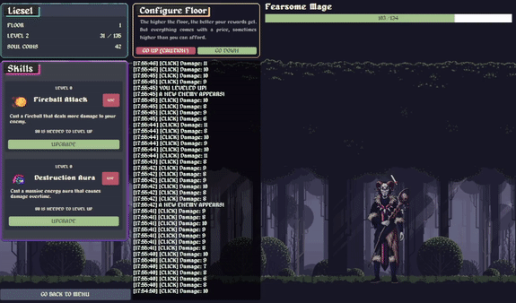

# Tales Of Liesel

Tales of Liesel is an open source idle-based game made with pourposes of learning how does threads and semaphores actually work. This project was initially made for Operational Systems (SSC0140) class at ICMC-USP. As an extension, all of the front-end related stuff (such as the UI) were made using C++ Qt. Besides being a fairly simple game, it had worked pretty well for learning pourposes.

Current build only does support Windows. Linux support coming later on.

#### Did I get a good grade? We'll see!

## Special credits

- Thanks to everyone who had worked with me this month to make this project happen.
- Thanks to [Alexander Nakarada](https://filmmusic.io/artists/alexander-nakarada) for the incredible medieval-like royalty free music used as BGM.
- Thanks to [Eder Muniz](https://edermunizz.itch.io) for the gorgeous background art.
- Thanks to [XYEzawr](https://xyezawr.itch.io) for the icons we've used.
- Elfic characters assets taken from [Craftpix](https://craftpix.net/freebies/free-dark-elf-pixel-art-asset-pack/).
